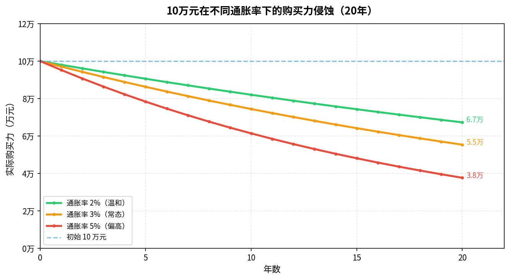
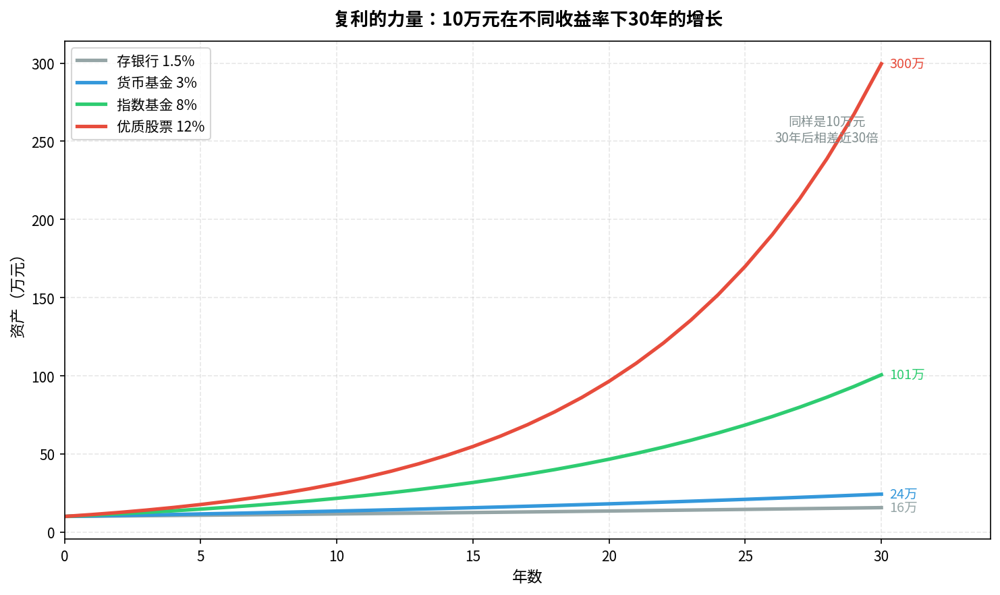

# 第一章：为什么要投资

> 钱放在银行里，看起来没变少——但实际上，它每天都在悄悄缩水。

---

## 1.1 通货膨胀：钱为什么会变毛

**通货膨胀**（Inflation）是指货币购买力随时间下降的现象。简单说：同样一张100元，今天能买到的东西，比10年前少。

- 2000年，北京一碗炸酱面大约1.5元；2024年，同一碗面要15元。面没变，钱"变薄"了10倍。
- 中国近20年平均通胀率约 **3%/年**，欧美约 **2-3%/年**。

> **程序员类比**：通胀就像你的代码每年悄悄多了3%的技术债——什么都不做，系统在自动劣化。



上图展示了10万元在不同通胀率下，20年后的实际购买力：
- 温和通胀（2%）：20年后只剩 **6.7万** 的购买力
- 常态通胀（3%）：20年后只剩 **5.5万**
- 偏高通胀（5%）：20年后只剩 **3.8万**

**结论**：什么都不做，钱在自动缩水。你必须让钱的增速跑赢通胀。

---

## 1.2 复利的力量：时间是最好的朋友

**复利**（Compound Interest）是"利滚利"——每期收益自动加入本金，下一期继续产生收益。

公式非常简单：

```
终值 = 本金 × (1 + 年收益率)^年数
```

举例：10万元，年收益8%，投资30年：
```
100,000 × (1.08)^30 ≈ 1,006,265 元
```

翻了10倍，而你什么都没多做——只是让时间做了工作。



上图对比了四种场景下，10万元30年后的结果：

| 场景 | 年收益率 | 30年后 |
|------|---------|--------|
| 存银行 | 1.5% | 约 15.6万 |
| 货币基金 | 3% | 约 24.3万 |
| 指数基金（历史均值） | 8% | 约 100.6万 |
| 优质股票组合 | 12% | 约 299.6万 |

> **关键洞察**：8% vs 12% 看起来只差4个百分点，30年后却相差近3倍。**时间放大了一切差距。**

复利的核心要素：
1. **本金** —— 越早开始越好，不必等到有很多钱
2. **收益率** —— 哪怕提升几个百分点，长期差距巨大
3. **时间** —— 最容易被低估，也最无法被补回来

> 爱因斯坦据传曾说："复利是世界第八大奇迹，懂它的人赚它，不懂的人付它。"

---

## 1.3 投资 vs 储蓄 vs 投机：三者有何不同

很多人把这三件事混为一谈，实际上它们有本质区别：

| | 储蓄 | 投资 | 投机 |
|--|------|------|------|
| **目标** | 保本，备用 | 跑赢通胀，实现增值 | 短期暴利 |
| **时间周期** | 随时可取 | 中长期（3年以上） | 极短期（天/周） |
| **风险** | 极低（跑不赢通胀） | 中等 | 极高 |
| **典型方式** | 银行活期/定期 | 指数基金、股票、债券 | 期货、杠杆、短线炒股 |
| **依赖** | 无需判断 | 基本面、趋势 | 运气、消息 |

**重要区分**：买一只股票持有10年，是投资；每天盯盘买卖，是投机。形式相同，本质不同。

> 本教程讨论的是**投资**，不是投机。投机可能让你短期赚钱，但统计上绝大多数散户亏损。

---

## 1.4 程序员的天然优势与常见误区

### 天然优势

- **理性思维**：不容易被情绪左右，适合执行规则化的投资策略
- **数学基础**：理解收益率、复利、统计不需要额外学习
- **信息检索**：能快速找到并辨别信息质量
- **工程思维**：擅长用系统化方法解决问题，投资也是一个系统

### 常见误区

1. **过度自信于分析能力**：写代码能力强 ≠ 选股能力强。市场有数万名专业分析师和量化团队，信息优势极难建立。

2. **想等"搞清楚"再投**：投资不是一道有标准答案的算法题。等你完全搞清楚，最好的入场时机已过去十年。

3. **追热点**：AI概念、区块链、元宇宙——这些你在技术上能理解，不代表能预判股价。

4. **忽视风险管理**：程序员习惯于"能运行就行"，但投资里，一次爆仓能归零十年努力。

---

## 1.5 投资的本质：用当下的钱换未来的现金流

投资的底层逻辑只有一句话：

> **用今天的消费换取未来持续的现金流回报。**

- 买股票：买的是公司未来的利润分红
- 买债券：买的是未来的固定利息
- 买房出租：买的是未来的租金
- 买黄金：买的是未来货币贬值时的购买力保障

所有资产的价值，都是未来现金流的折现。理解了这一点，你就理解了投资的底层逻辑。

---

## 本章小结

| 概念 | 要点 |
|------|------|
| 通货膨胀 | 钱自动缩水，中国约3%/年，必须跑赢通胀 |
| 复利 | 时间 × 收益率的乘法效应，越早开始越好 |
| 投资 vs 投机 | 中长期持有优质资产 vs 短期博差价，本质不同 |
| 投资本质 | 用当下的钱换未来的现金流 |

**下一章**：在知道为什么要投资之后，我们来看清楚整个金融市场的地图——有哪些资产、在哪里交易、谁是参与者。

---

*→ [第二章：金融市场全景图](chapter2.md)*
