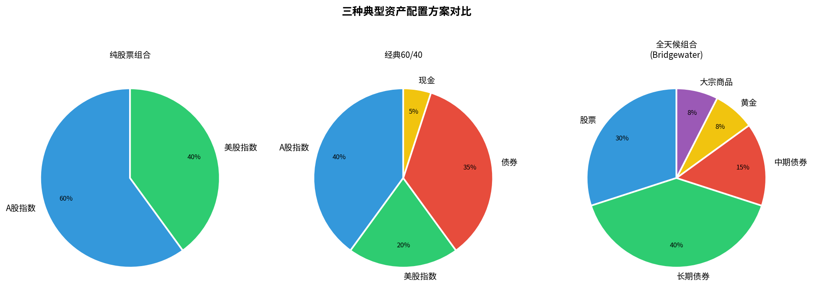
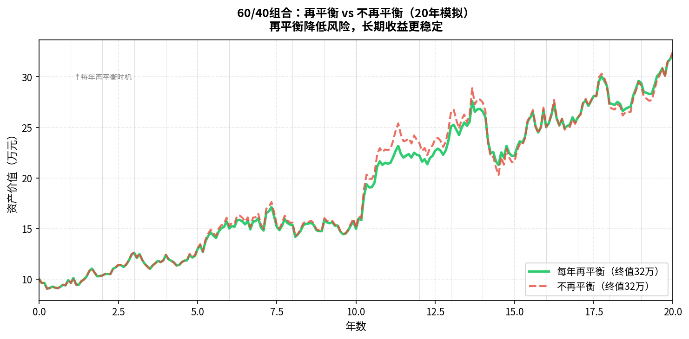

# 第十一章：投资策略与资产配置

> 不是选股高手？那就做好配置。资产配置决定了90%以上的长期收益差异。

---

## 11.1 资产配置的核心逻辑

著名研究（Brinson 1991）发现：

> **超过90%的投资组合长期收益差异，来自资产配置决策，而非个股选择或市场择时。**

简单说：**你把钱分配到哪些大类资产，比你选哪支具体股票更重要。**

资产配置的目标：
- 分散风险（各类资产在不同经济环境下的表现不同）
- 稳定收益（不会因为某一类资产大跌而一蹶不振）
- 长期坚持（组合波动小，才能不被情绪驱动错误操作）

---

## 11.2 股债平衡：经典的60/40组合

最经典的资产配置方案：**60%股票 + 40%债券**

历史表现（美国市场约100年数据）：
- 年化收益：约8-9%
- 最大回撤：约40%（远低于纯股票的55%）
- 收益/风险比：优于纯股票

**为什么股债负相关？**

通常情况下：
- 经济衰退时：股票跌，债券涨（避险需求，利率下降）
- 经济扩张时：股票涨，债券跌（资金流出债券买股票）

> 这种负相关性不是铁律，2022年美联储激进加息时，股票和债券同时下跌（少见的特殊情况）。

---

## 11.3 全天候策略（All Weather Portfolio）

由对冲基金桥水（Bridgewater）创始人瑞·达里奥提出：

```
股票：30%
长期债券（20年以上）：40%
中期债券：15%
黄金：7.5%
大宗商品：7.5%
```



**设计逻辑**：基于"风险平价"——让每类资产的**风险贡献**相等，而非资金比例相等。

历史表现（1984-2013）：
- 年化收益：约9.5%
- 最大回撤：约11%（远低于60/40的40%）
- 年度亏损：30年中只有4年亏损

> **适合中国投资者的改版**：将美国债券替换为中国国债/债券基金，将大宗商品替换为黄金ETF或商品期货ETF。

---

## 11.4 定投策略的正确姿势

**定投**适合以下情况：
- 有稳定收入，每月有固定结余
- 没有时间精力频繁操作
- 不确定当前是否是好的入场时机（大多数时候你都不确定）

**完整定投SOP**：

```
1. 选标的：宽基指数（沪深300/中证500/标普500）
2. 定金额：每月投入金额 = 可投资资金 × 20-30%
3. 定时间：每月固定日（如发工资后3天）
4. 设止盈：累计盈利30%/50%时，分批减仓（3-6个月内减完）
5. 不止损：下跌时不要停止定投（下跌是低价买入机会）
6. 坚持：至少3年，最好5年以上
```

**定投的局限**：
- 长期上涨市场中，定投跑不过一次性买入（因为一直有资金在外等待）
- 长期下跌市场中（如日本1990-2010），定投也会持续亏损
- 关键是选对指数（有长期上涨潜力的市场）

---

## 11.5 再平衡：定期调整仓位的意义

**再平衡**（Rebalancing）= 定期将偏离目标的仓位调回原始比例。



**为什么需要再平衡？**

```
初始：股票60%，债券40%

一年后：股票涨了30%，债券涨了5%
新比例：股票70%，债券30%（风险增大）

再平衡操作：卖出部分股票，买入债券，回到60/40
→ 被迫"高卖低买"，长期有利
→ 维持风险水平稳定
```

**再平衡频率建议**：
- 每年1次（年末）：最简单，成本低
- 偏离超过5%时触发：动态再平衡，更精准
- 不建议每月，交易成本高且无必要

---

## 11.6 生命周期与风险承受度

不同人生阶段，合理的股票仓位不同：

| 年龄段 | 建议股票仓位 | 理由 |
|--------|------------|------|
| 25-35岁 | 70-90% | 时间长，可以承受波动，复利最关键 |
| 35-45岁 | 60-70% | 家庭责任增加，略降风险 |
| 45-55岁 | 40-60% | 逐步向保守迁移 |
| 55岁以上 | 20-40% | 保值优先，不能承受大幅回撤 |

**简单规则**："110 - 你的年龄 = 股票合理仓位"

```
30岁：110 - 30 = 80% 股票
50岁：110 - 50 = 60% 股票
```

---

## 11.7 程序员适用的简单组合方案

综合以上原则，适合入门程序员的**三基金组合**：

| 资产 | 标的 | 建议比例 | 作用 |
|------|------|---------|------|
| A股宽基 | 沪深300ETF（510300）| 40% | 国内市场增长 |
| 美股宽基 | 纳斯达克100ETF（513100）| 30% | 全球科技龙头 |
| 债券 | 中债7-10年国债ETF（511260）| 20% | 稳定器，降波动 |
| 黄金 | 黄金ETF（518880）| 10% | 通胀对冲 |

**操作方法**：
1. 首次建仓：3-6个月内分批买入
2. 每月定投：按比例等额买入
3. 每年12月：检查比例，再平衡
4. 止盈：整体组合收益超过30%时，考虑逐步减仓

> 这不是投资建议，是一个**思路框架**。实际操作需要结合自己的收入、负债、风险承受度调整。

---

## 本章小结

| 策略 | 核心思想 | 适合人群 |
|------|---------|---------|
| 60/40 | 股债平衡，经典稳健 | 中等风险承受者 |
| 全天候 | 风险平价，四季适应 | 保守型，追求低波动 |
| 三基金组合 | 简单分散，低成本 | 入门投资者 |
| 定投 | 纪律代替择时 | 有稳定收入，无时间盯盘 |
| 再平衡 | 高卖低买，维持风险水平 | 所有人都应执行 |

**下一章**：策略都懂了，但你能坚持执行吗？投资最大的敌人是自己。

---

*← [第十章](chapter10.md) | → [第十二章：投资心理与常见误区](chapter12.md)*
