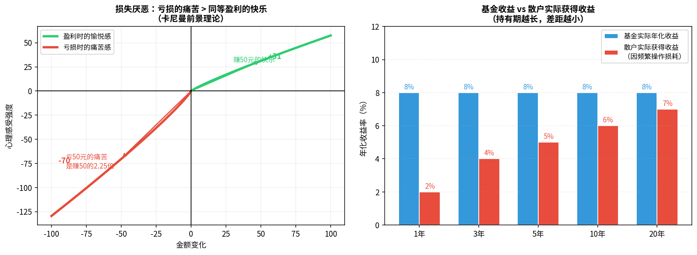

# 第十二章：投资心理与常见误区

> 投资最大的变量不是市场，而是你自己。行为金融学告诉我们，人类大脑天生不适合投资。

---

## 12.1 损失厌恶：为什么亏了舍不得止损



**损失厌恶**（Loss Aversion）是行为经济学最重要的发现之一，由卡尼曼（Daniel Kahneman）和特沃斯基（Amos Tversky）提出：

> **亏损1元的痛苦，约等于盈利2.25元的快乐。**

这种天生的不对称性导致了很多错误行为：

```
场景：你买了一只股票，亏损了30%

理性决策：评估公司基本面，判断是否继续持有
大脑实际：不愿意"锁定亏损"，一直等待"回本"
结果：错误持有烂股票，错过其他机会
```

**应对方法**：
- 买入前设定**止损线**（如-20%），跌破就执行，不依赖感情
- 问自己："如果我今天第一次看到这支股票，我会买吗？"——如果不会，就应该卖
- 理解"回本"不是目标，**正确的投资决策**才是

---

## 12.2 锚定效应：为什么总想等"回本"再卖

**锚定效应**（Anchoring）：人们在做决策时，过度依赖第一个接触到的信息（"锚"）。

```
你在100元买了一只股票，现在跌到60元
"锚"：100元（你的成本价）
错误行为：死守等回到100元才卖
```

**关键认知**：
> 你的买入成本对市场来说毫无意义。市场不知道也不在乎你花了多少钱。

股票的未来走势，只取决于公司的未来价值，与你的买入价格完全无关。

**解锚方法**：
- 遮住自己的成本价，只看当前市值和公司价值
- 问："如果我手里有等额现金，我今天还会买它吗？"

---

## 12.3 羊群效应：追涨杀跌的根源

**羊群效应**（Herding）：人们在不确定情况下，倾向于模仿多数人的行为。

在投资里，这导致了最致命的行为模式：

```
↑ 市场大涨 → 新闻铺天盖地 → 朋友圈都在晒收益
→ 你感觉"错过了" → 高位买入
→ 市场回调 → 亏损 → 恐惧抛出
→ 市场反弹 → 追涨…（循环）
```

**历史规律**：
- 2007年A股顶部：散户开户数量创历史新高
- 2015年杠杆牛市顶部：同上
- 每次市场顶部，都是散户最狂热、机构最谨慎的时候

**应对方法**：
- 当朋友圈都在讨论某只股票时，这是危险信号而非机会
- 巴菲特指标：当市场市值/GDP超过历史高位，要更谨慎
- 坚持计划，不因市场噪音改变策略

---

## 12.4 过度自信：为什么散户总觉得自己能跑赢市场

多项研究表明，超过80%的人认为自己的驾驶技术高于平均水平。投资里也一样：

**过度自信的表现**：
- 频繁交易（认为自己能判断短期涨跌）
- 重仓单只个股（认为自己研究透彻）
- 忽视风险（认为坏事发生在别人身上）

**冷静的数据**：
- 学术研究：频繁交易的散户平均年化收益比买入持有低约6%（Barber & Odean, 2000）
- 美国共同基金数据：超过80%的主动基金10年跑输指数

> "你能意识到自己不是市场里最聪明的人，这本身就是一种优势。" —— 霍华德·马科斯

---

## 12.5 短期噪音与长期趋势：如何不被每天的涨跌带着走

每天打开App看净值，会感受到大量噪音：

```
每天：价格波动主要是随机噪音
每周：仍然主要是噪音
每月：少量信号开始出现
每年：信号明显增强
每5年：基本面驱动为主
```

**程序员类比**：短期价格就像系统日志——大量无意义的输出。你需要的是监控仪表盘（长期趋势），而不是滚动刷新log（每天看净值）。

**实用建议**：
- 不要每天看持仓
- 删除券商App的行情通知（或设置只看大幅波动）
- 把资金转入后"放置"，约定每月或每季度检查一次

---

## 12.6 建立投资纪律：规则比感觉更可靠

**投资纪律**的本质是：在情绪影响判断之前，先制定好规则，然后机械执行。

| 规则类型 | 示例 |
|---------|------|
| 买入规则 | 每月15日定投1000元沪深300ETF |
| 止盈规则 | 组合盈利30%，3个月内分批减仓一半 |
| 止损规则 | 单只个股亏损超20%，无条件卖出 |
| 再平衡规则 | 每年12月，将偏离超5%的仓位调回 |
| 信息隔离 | 不看预测类财经节目，不听消息买股 |

**写下来并坚持**：投资计划最好用文字记录，放在显眼的地方。下次想打破规则时，先读一遍。

---

## 12.7 何时该卖出：止盈与止损的逻辑

**卖出是投资里最难的决策**——因为卖出意味着结果确定，不确定性消失，人会面临"卖亏了"或"卖早了"的后悔感。

### 应该卖出的情况

**止盈**：
- 完成了投资目标（计划买房/子女教育）
- 组合大幅偏离目标比例，需要再平衡
- 对应资产出现系统性高估（PE极高、市场极度乐观）

**止损**：
- 公司基本面发生重大负面变化（不是股价跌，而是公司变坏了）
- 跌破预设止损线（保护本金）
- 你发现买入的逻辑是错误的

### 不应该卖出的情况

```
❌ 因为恐慌，市场大跌就卖
❌ 因为贪婪，涨了一点就急于"落袋为安"
❌ 因为无聊，没有理由地调仓
❌ 因为听到消息，冲动换仓
```

> **最重要的事**：长期持有优质资产组合，会让大多数买卖决策变得不那么重要。

---

## 本章小结

| 心理偏差 | 表现 | 应对 |
|---------|------|------|
| 损失厌恶 | 死守亏损股，不愿止损 | 提前设规则，机械执行 |
| 锚定效应 | 等"回本"再卖 | 忘记成本，评估当前价值 |
| 羊群效应 | 追涨杀跌 | 市场狂热时更谨慎 |
| 过度自信 | 频繁交易，重仓单股 | 相信数据，不相信感觉 |
| 短视偏差 | 每天看净值，焦虑 | 降低查看频率 |

---

## 全书总结：投资者的成长路径

```
阶段一（入门）：
  ✓ 理解通胀和复利
  ✓ 开户，买入沪深300指数基金
  ✓ 开始定投，养成习惯

阶段二（稳固）：
  ✓ 建立股债黄金三资产组合
  ✓ 每年再平衡一次
  ✓ 读几本经典书（附录A）
  ✓ 学会看财报基础指标

阶段三（进阶）：
  ✓ 研究个股（选择自己熟悉的行业）
  ✓ 理解宏观经济周期
  ✓ 建立自己的投资体系和原则

阶段四（成熟）：
  ✓ 有清晰的投资哲学
  ✓ 在市场极端情绪中保持理性
  ✓ 收益来自于纪律，而非运气
```

**最后一句话**：投资是一场终身的游戏。不要试图在一两年内致富，而是用十年、二十年，让复利为你工作。

---

*← [第十一章](chapter11.md) | → [附录A：推荐书单](appendix_a.md)*
