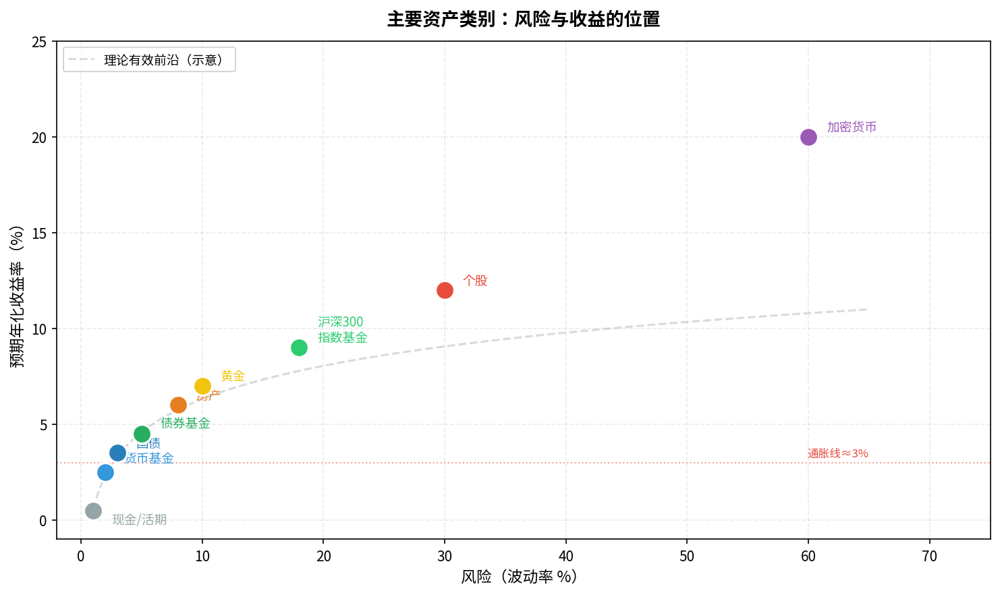
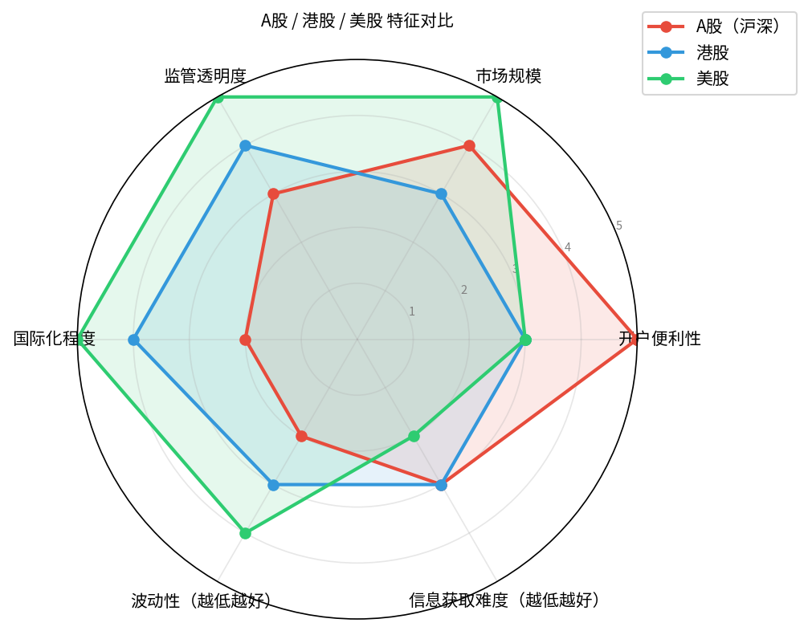

# 第二章：金融市场全景图

> 先看地图，再走路。不了解全局，容易在一棵树上吊死。

---

## 2.1 什么是金融市场

**金融市场**是买卖"金融资产"的场所——不是实物市场（菜市场），而是买卖**钱的使用权和所有权凭证**的地方。

本质上，金融市场解决一个问题：

> **有闲钱的人** ↔ **需要钱的人**

- 企业缺钱扩张，发行股票，你买了就成为股东
- 政府要修路建桥，发行国债，你买了就是借钱给政府
- 银行存款，你借钱给银行，银行再借给需要贷款的人

市场让这个"借贷与投资"的过程更高效、更透明、更流动。

---

## 2.2 主要资产类别一览

金融市场里可以买卖的"东西"叫**资产**（Asset）。不同资产的风险和收益特征差异极大：



| 资产类别 | 典型收益率 | 典型风险 | 适合场景 |
|----------|-----------|---------|---------|
| 现金/活期 | 0.3-0.5% | 极低 | 应急备用金 |
| 货币基金 | 1.5-3% | 极低 | 短期闲置资金 |
| 国债 | 2-4% | 低 | 稳健配置 |
| 债券基金 | 3-6% | 低中 | 稳健增值 |
| 黄金 | 历史约6-7% | 中（波动大） | 对冲通胀/避险 |
| 房产 | 视地区差异 | 中 | 长期持有 |
| 股票指数基金 | 历史约8-10% | 中高 | **长期投资主力** |
| 个股 | 不确定 | 高 | 有研究能力者 |
| 加密货币 | 极度不确定 | 极高 | 投机（谨慎） |

> **图中红色虚线**是通胀线（约3%）。收益率低于这条线，你在实际上亏钱。

**核心原则**：
- 风险越高，潜在收益越高（但也可能亏损更多）
- **没有高收益低风险的资产**——凡是声称"稳赚不赔"的，都是骗局

---

## 2.3 市场的参与者

金融市场里不只有你这样的散户，还有很多"玩家"：

```
市场参与者
├── 散户（个人投资者）
│   └── 资金小，信息劣势，但数量巨大
├── 公募基金（股票型、债券型、货币型）
│   └── 向公众募资，受严格监管，规模万亿级
├── 私募基金
│   └── 向高净值客户募资，策略更灵活，门槛高（100万+）
├── 保险公司
│   └── 管理巨额保费，偏好低风险债券
├── 券商自营
│   └── 用自有资金投资，有专业量化团队
├── 外资机构（QFII）
│   └── 外国机构通过特定渠道投资A股
└── 量化对冲基金
    └── 用算法和模型高频交易
```

> **程序员友情提示**：你在散户层。机构有专业分析师、实时数据、算法交易、内部研报。正面硬拼信息优势，胜算极低。正确策略是**不和它们比选股，而是搭顺风车**（买指数基金）。

>Q: 什么是指数基金？
>
> **A**：指数基金是按照某个市场指数（如沪深300）的成分股构成，等比例买入一篮子股票的基金。它不主动选股，只是"复制"指数。你买一份沪深300指数基金，相当于同时持有A股最大的300家公司的股票。详见[第五章：基金](chapter5.md)。
---

## 2.4 A股、港股、美股：三大市场的差异



### A股（沪深交易所）
- **特点**：中国大陆居民开户最方便，涨跌停限制（10%，科创板20%），T+1（今天买明天才能卖）
- **规模**：全球第二大股票市场，市值约80万亿人民币（2024）
- **代表指数**：沪深300、上证指数、创业板指

> **Q：房产市场当前大概市值多少？**
>
> **A**：中国住宅房产总市值约 **400-500万亿人民币**（2024年估算），是A股（约80万亿）的5-6倍，也是全球最大的单一资产类别之一。作为参考，美国住宅市值约40-45万亿美元，中国房产规模约为其1.5倍。正因体量极大，房产价格的轻微波动就会对居民财富和经济产生巨大影响，这也是政策对房市高度重视的根本原因。
>
> **Q：美国的股票市场市值呢？大概是多少美元？**
>
> **A**：美国股市（NYSE + NASDAQ 合计）总市值约 **45-50万亿美元**（2024年），折合人民币约330-360万亿，占全球股市总市值的约 **44%**。作为对比：A股约80万亿人民币（≈11万亿美元），美股是A股的4倍以上。全球股市总市值约110万亿美元，美国一国独占近半，这也是为什么美联储加息会引发全球市场震动。

### 港股（香港交易所）
- **特点**：国际化，和A股同一家公司可能有价差（AH溢价），T+0，无涨跌停
- **上市公司**：腾讯、美团、京东等互联网巨头主要在港股
- **进入方式**：沪港通（无需开港股账户）或直接开港股账户

### 美股（NYSE / NASDAQ）
- **特点**：全球最发达市场，信息透明，注册制，公司质量相对更高
- **代表指数**：标普500（S&P500）、纳斯达克100（QQQ）、道琼斯工业指数
- **进入方式**：富途证券、老虎证券、盈透证券开户

> **入门建议**：先从A股和A股基金入手，熟悉后再考虑港股/美股。不要一开始就三个市场同时操作。

---

## 2.5 交易所、券商、托管行：钱和证券在哪里

很多新手分不清这三者：

```
你（投资者）
   │
   ▼
券商（Broker）
如：华泰、中信、东方财富、富途
─ 你开户的地方
─ 帮你下单、撮合
─ 类似"中介"
   │
   ▼
交易所（Exchange）
如：上交所（SSE）、深交所（SZSE）、纳斯达克
─ 实际撮合买卖的地方
─ 你看不见但一直在运行
   │
   ▼
登记托管机构
如：中国证券登记结算公司（中登）
─ 记录"这支股票真正属于谁"
─ 类似"产权登记处"
```

> 重要：你的钱和股票**不在**券商账户里消失，是分开托管的。券商倒闭，你的股票和资金不会消失（受中登保护）。

---

## 2.6 市场的开放时间与交易规则

### A股交易时间（工作日）
- 上午：09:30 - 11:30
- 下午：13:00 - 15:00
- 集合竞价（开盘前）：09:15 - 09:25

### 港股交易时间（香港时间）
- 上午：09:30 - 12:00
- 下午：13:00 - 16:00

### 美股交易时间（北京时间）
- 冬令时：21:30 - 次日04:00
- 夏令时：20:30 - 次日03:00
- 有盘前/盘后交易，流动性较低

### A股核心规则速记

| 规则 | 内容 | 影响 |
|------|------|------|
| T+1 | 今天买，明天才能卖 | 无法当天高抛低吸 |
| 涨跌停 | 主板±10%，科创板±20% | 极端行情会封板，流动性丧失 |
| 印花税 | 卖出时收0.05% | 频繁交易成本高 |
| 交易佣金 | 券商收，约0.02-0.03% | 长线持有可忽略 |

---

## 本章小结

| 概念 | 要点 |
|------|------|
| 金融市场 | 连接"有钱人"和"需要钱的人"的撮合机制 |
| 资产类别 | 现金→债券→黄金→股票，风险收益依次升高 |
| 市场参与者 | 散户信息劣势，搭指数基金顺风车是理性选择 |
| 三大市场 | A股（最易入门）、港股、美股各有特点 |
| 交易基础 | 了解券商/交易所/托管的分工，T+1/涨跌停规则 |

**下一章**：有了全局视野，我们来把最重要的基础概念一一讲清——收益率、风险、仓位……这些词你以后天天会看到。

---

*← [第一章](chapter1.md) | → [第三章：必懂的基础概念](chapter3.md)*
