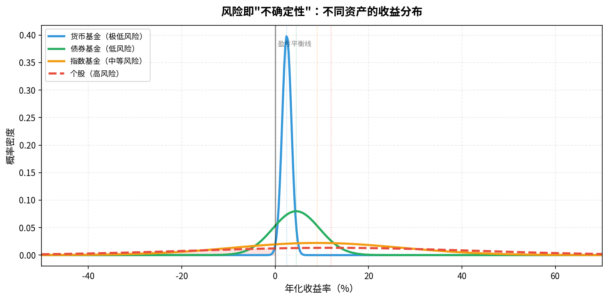
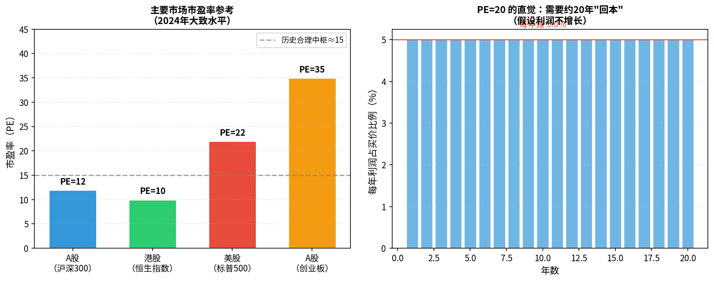

# 第三章：必懂的基础概念

> 这些词你会在财经新闻、App、对话里反复看到。搞懂它们，你才能"听懂行话"。

---

## 3.1 收益率与年化收益率

**收益率**（Return）= 赚到的钱 ÷ 投入的本金

```
收益率 = (现值 - 成本) / 成本 × 100%
例：10万买入，12万卖出 → 收益率 = 20%
```

但问题来了：**20% 是花了1年还是5年赚到的？** 这就需要年化。

**年化收益率**把任意时间段的收益换算成"每年多少"：

```
年化收益率 = (1 + 总收益率)^(1/年数) - 1

例：5年累计收益60%
年化 = (1.6)^(1/5) - 1 ≈ 9.86%/年
```

```
收益率 = (现值 - 成本) / 成本 × 100%
例：4万买入，年化 5%
2年后：4万 × (1 + 5%)^2 ≈ 4.41万
```

> **Q：年化 5%，多久能翻倍？**
>
> **A**：约 **14.4年**。有个简便心算公式叫"**72法则**"：用 72 除以年化收益率，就是翻倍所需年数。
>
> ```
> 翻倍年数 ≈ 72 ÷ 年化收益率(%)
>
> 年化 5%：72 ÷ 5  = 14.4 年
> 年化 8%：72 ÷ 8  = 9   年
> 年化 12%：72 ÷ 12 = 6   年
> 年化 3%（通胀）：72 ÷ 3 = 24 年（购买力腰斩只需24年）
> ```
>
> 72法则是近似值，精确计算为 `ln(2) / ln(1+r)`，但日常估算误差不超过1年，够用。
>

> **为什么年化很重要**：有人吹"我买某某赚了50%"，但他持有了10年……年化只有4%，还跑不赢指数基金。比较任何投资都要用年化口径。

常见收益率参考基准：

| 基准 | 数值 |
|------|------|
| 银行活期 | ~0.35% |
| 余额宝/货币基金 | 1.5-3% |
| 通货膨胀 | ~3% |
| 沪深300历史均值 | ~8-10% |
| 巴菲特长期年化 | ~20%（极罕见） |

---

## 3.2 风险与波动率

投资里"风险"不只是"可能亏钱"，更精确的含义是：**不确定性，结果偏离预期的程度**。

数学上用**波动率**（Volatility，即标准差）来量化：

```
波动率高 → 涨跌幅度大 → 风险高
波动率低 → 涨跌幅度小 → 风险低
```



图中可以看出：
- **货币基金**：分布极窄，收益稳定在2-3%，几乎不会亏
- **债券基金**：分布稍宽，偶尔小幅亏损
- **指数基金**：分布很宽，可能大涨也可能大跌，但长期中心在正区间
- **个股**（红虚线）：分布最宽，亏损区域（左侧阴影）面积最大

> **程序员类比**：波动率 = 函数的方差。高方差函数每次调用结果差异巨大，低方差函数输出稳定。

---

## 3.3 风险与收益的权衡：没有免费的午餐

这是投资里最核心的铁律：

> **高收益必然伴随高风险。任何宣称"保本保收益"又高于存款的产品，都是骗局。**

为什么？因为如果有稳赚不赔的高收益资产，所有机构和专业投资者都会涌入，把价格买高、收益率压低，直到风险-收益均衡。

这叫**无套利原则**——市场会消灭显而易见的免费午餐。

| 常见骗局话术 | 背后真相 |
|-------------|---------|
| "年化15%，本金保障" | 要么骗局，要么极高风险隐藏 |
| "内部消息，必涨" | 内幕交易（违法）或故意误导 |
| "本金安全，收益10%+" | 高风险债务质押，随时可能爆雷 |

---

## 3.4 流动性：钱能不能及时取出来

**流动性**（Liquidity）= 资产转换成现金的速度和成本。

```
流动性高：随时可以变现，且几乎不损失价值
流动性低：变现慢，或变现要付出折价
```

| 资产 | 流动性 |
|------|--------|
| 活期存款 | 极高（秒取） |
| 货币基金 | 高（T+0 快赎，限额1万） |
| 股票（主板） | 高（交易日可卖，T+1到账） |
| 基金（场外） | 中（赎回T+1到T+3） |
| 房产 | 低（挂牌到成交数月） |
| 私募基金 | 低（通常有锁定期） |

> <u>**实用原则**：留足3-6个月生活费的**流动性强资产**（货币基金或活期）</u>，其余资金再做投资。否则急用钱时被迫低价卖出，本来盈利的投资被迫亏损出局。

> **Q：货币基金限额 1 万，如何保证流通性？**
>
> **A**：1万元是**快速赎回（T+0）**的每日限额，不是全部资金的上限。超出部分走普通赎回（T+1），次日到账，流动性依然很高。实际操作中有几个补充策略：
>
> 1. **分散到多只货币基金**：余额宝、微信零钱通、券商货币基金各放一部分，每只各有1万快赎额度，合计可即时取出数万元
> 2. **大额急用提前一天赎回**：如果知道明天需要大额资金，今天下午3点前赎回即可，T+1到账
> 3. **保留部分银行活期**：真正的应急资金（1-2个月生活费）放活期，秒级到账，其余才放货币基金
>
> 日常消费场景下，1万快赎额度通常足够；真正需要几十万的大额支付（买房首付等），提前1天操作即可解决。

---

## 3.5 仓位与资产配置

**仓位**（Position）= 某类资产占你总投资资金的比例。

```
假设你有 20万可投资：
- 10万买指数基金 → 股票仓位 50%
- 5万买债券基金  → 债券仓位 25%
- 3万放货币基金  → 现金仓位 15%
- 2万买黄金ETF   → 黄金仓位 10%
```

**仓位管理**的核心原则：
1. 不要把所有钱押在同一类资产
2. 不要重仓单只个股（分散风险）
3. 根据自己的风险承受度设定最大股票仓位
4. 仓位不是一成不变的，市场变化时可以调整

---

## 3.6 牛市与熊市

| 术语 | 含义 | 特征 |
|------|------|------|
| 牛市（Bull Market） | 市场整体持续上涨 | 乐观情绪，成交量大，散户踊跃 |
| 熊市（Bear Market） | 市场从高点下跌20%以上 | 悲观情绪，成交量萎缩，散户离场 |
| 震荡市 | 没有明显趋势，横盘 | 高买低卖反复折腾，消磨心态 |
| 技术性回调 | 短期下跌10%以内 | 正常，不算熊市 |

> **关键认知**：牛熊转换无法精确预测。历史上，每次牛市顶部和熊市底部，都有99%的人判断错误。不试图"抄底逃顶"，是保护自己的最好方式。

---

## 3.7 市盈率（PE）、市净率（PB）：股票贵不贵的尺子



### 市盈率（PE，Price-to-Earnings Ratio）

```
PE = 股价 / 每股年利润
   = 总市值 / 年净利润
```

**直觉理解**：你花了多少钱，买到公司每年赚1元的能力。
- PE = 20，意味着按当前利润需要**20年**才能"回本"
- PE越低，理论上越便宜（需结合行业和增长）
- A股历史PE中枢约12-15，高于20偏贵，低于10偏便宜

### 市净率（PB，Price-to-Book Ratio）

```
PB = 股价 / 每股净资产
   = 总市值 / 账面净资产
```

**直觉理解**：你花了多少钱，买到公司"账面价值"的1元。
- PB < 1：市值低于净资产，理论上有安全边际（但要警惕资产质量）
- 适合用于银行、地产等重资产行业

> **使用注意**：PE/PB只是参考，不是买入信号。高增长公司可以长期高PE，低PE公司可能是价值陷阱。需要结合行业、增长率、护城河综合判断。

---


> **Q：PE、PB 的概念看的似懂非懂，请用更通俗的语言或案例说明。**
>
> **A**：用买奶茶店来类比。
>
> **PE（市盈率）= 你花多少钱，买到"每年赚1元"的能力**
>
> 假设你想买一家奶茶店入股：
> - 这家店每年净利润 **10万元**
> - 老板开价 **150万元**
> - PE = 150 ÷ 10 = **15**
>
> 意思是：按现在的盈利速度，你需要 **15年** 才能靠利润把本金赚回来。
> PE 越低 → 回本越快 → 相对越便宜。
>
> 但有个陷阱：如果这家店明年要开10家分店、利润将翻3倍，PE=15就不贵；如果店快倒闭了，PE=5也嫌贵。**所以PE要结合增长来看，不能单看数字。**
>
> ---
>
> **PB（市净率）= 你花多少钱，买到"账面上1元的家当"**
>
> 还是那家奶茶店：
> - 店里的设备、存货、现金加起来（净资产）= **100万元**
> - 老板开价 **150万元**
> - PB = 150 ÷ 100 = **1.5**
>
> 意思是：你花了1.5元，买到账面上价值1元的资产，溢价50%。
> PB < 1 → 你花的钱比店里的家当还少（理论上捡便宜了，但要警惕"家当"是不是值那么多）。
>
> **PB 适合用于重资产行业**（银行、钢铁、地产），因为这些公司的核心价值就是资产本身。
> **科技公司不适合用PB**，因为工程师的能力、代码、品牌不在账面上，净资产严重低估真实价值。
>
> ---
>
> 一句话总结：<u>**PE 看"赚钱能力贵不贵"，PB 看"家当贵不贵"**</u>。两者都是参考，不是绝对的买卖信号。
>
> **Q：简单理解就是，PE、PB理论上都是越低越好，PE结合增长率看，PB警惕假家当？**
>
> **A**：理解得非常到位，再补一个合并框架：
>
> | 指标 | 越低越好？ | 关键补充问题 |
> |------|-----------|-------------|
> | PE | 是，但… | 利润是真实的吗？增速能持续吗？ |
> | PB | 是，但… | 资产能变现吗？有没有藏着的负债？ |
>
> <u>**PE 的"但是"**：低PE有时是陷阱——公司利润马上要暴跌，PE看起来低但明年会变很高。所以要看**PEG**（PE ÷ 利润增速），PEG < 1 才算真便宜。</u>
>
> **PB 的"假家当"具体指**：
> - 库存是卖不出去的滞销品（账面100万，实际一分不值）
> - 应收账款是收不回来的坏账
> - 商誉是收购时溢价留下的虚数（随时可能减值归零）
>
> 所以结合起来看才稳：**PE低 + PB低 + 现金流健康** = 三重验证，可信度高很多。

## 3.8 通货膨胀与利率：宏观环境如何影响投资

<u>**利率**是钱的"租金"。</u>央行通过调整基准利率来影响整个经济：

```
利率上升 → 借贷更贵 → 企业利润受压 → 股价下跌
         → 债券收益率上升 → 债券价格下跌（反向关系）
         → 货币升值 → 出口受压

利率下降 → 借贷更便宜 → 企业扩张 → 股价上涨（通常）
         → 债券价格上涨
         → 货币贬值 → 出口受益
```

| 宏观状态 | 通胀 | 利率 | 受益资产 |
|----------|------|------|---------|
| 经济扩张 | 上升 | 上升 | 股票（早期）、大宗商品 |
| 通胀过热 | 高 | 高 | 黄金、商品、TIPS |
| 经济衰退 | 下降 | 下降 | 债券、防御型股票 |
| 通缩 | 低/负 | 低 | 现金、国债 |

> 这些关系是统计规律，不是绝对定律。理解它，是为了大方向不走反；不要试图用它精确择时。

---

## 本章小结

| 概念 | 一句话 |
|------|--------|
| 年化收益率 | 所有收益比较的统一口径 |
| 波动率 | 风险的量化表达，越高越不确定 |
| 无免费午餐 | 高收益必有高风险，保本高收益是骗局 |
| 流动性 | 留足备用金，不要被迫低价卖出 |
| 仓位 | 不押注单一资产，分散是基本功 |
| PE/PB | 估值参考工具，不是买入信号 |
| 利率 | 宏观最核心的价格信号，影响所有资产 |

**下一章**：进入具体资产——先讲股票，理解"买股票就是买公司一部分"到底是什么意思。

---

*← [第二章](chapter2.md) | → [第四章：股票](chapter4.md)*
