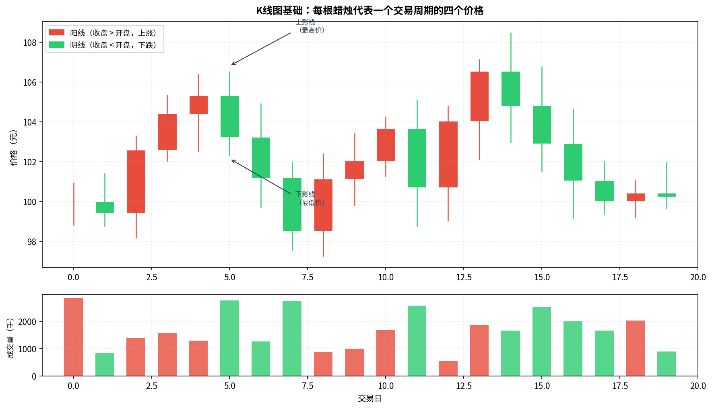
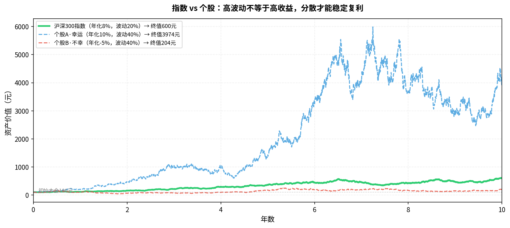

# 第四章：股票

> 买股票就是买公司的一部分——这句话到底是什么意思，以及它意味着什么风险。

---

## 4.1 股票是什么：所有权的凭证

**股票**（Stock / Share）是公司所有权的凭证。

当你买了某公司100股，你就拥有了该公司一小部分：
- 有权分享公司利润（**分红**）
- 有权参与股东大会投票（实际上散户基本不行使）
- 承担公司亏损乃至破产的风险

```
公司总市值 = 每股股价 × 总股本

例：贵州茅台
股价 = 1700元
总股本 ≈ 12.56亿股
总市值 ≈ 2.1万亿人民币

你买1手（100股）= 17万元 = 持有茅台约0.0000008%
```

> **程序员类比**：股票就像公司的"股权Token"，总发行量固定（总股本），你持有的比例决定了你对公司价值和利润的份额。

---

## 4.2 公司如何上市：IPO 的逻辑

**IPO**（Initial Public Offering，首次公开募股）是公司第一次向公众出售股票的过程。

```
创业 → 私募融资（天使/VC/PE）→ 上市审核 → IPO → 二级市场交易
```

- **发行价**：IPO时定的价格，由承销商（投行）和公司协商定价
- **上市首日**：投资者在二级市场按市场价交易
- **为什么上市**：公司融资、创始人套现、提升品牌

> 散户通常无法参与IPO定价（一级市场），只能在上市后的二级市场买卖。上市初期往往炒作严重，估值虚高，新手需谨慎。

---

## 4.3 股价怎么形成：供需与预期

股价本质上是**买卖双方博弈的结果**：

```
买方多于卖方 → 价格上涨
卖方多于买方 → 价格下跌
```

但影响买卖意愿的因素非常复杂：

| 因素 | 如何影响 |
|------|---------|
| 公司业绩超预期 | 买方增加 → 价格上涨 |
| 宏观政策收紧 | 卖方增加 → 价格下跌 |
| 市场情绪恐慌 | 大量卖出 → 价格暴跌（与基本面无关） |
| 资金面宽松 | 钱多 → 推高所有资产价格 |
| 主力拉升 | 少数大资金推高价格吸引散户 |

> **核心洞察**：短期股价由情绪和资金决定，长期股价由公司基本面决定。巴菲特的名言："短期市场是投票机，长期市场是称重机。"

---

## 4.4 如何分析一家公司：基本面入门

**基本面分析**（Fundamental Analysis）是通过研究公司的经营状况来判断股票是否值得投资。

核心三张财务报表：

### 利润表（Income Statement）
> 公司这一年赚了多少钱？

```
营收 - 成本 = 毛利润
毛利润 - 费用 = 营业利润
营业利润 - 税 = 净利润（最终"到手的钱"）
```

关注指标：**净利润增速**、**毛利率**（毛利/营收）

### 资产负债表（Balance Sheet）
> 公司有多少家当，欠了多少债？

```
资产 = 负债 + 股东权益
```

关注指标：**资产负债率**（负债/资产，越低越稳）、**现金储备**

### 现金流量表（Cash Flow Statement）
> 公司实际进出了多少真金白银？

> **为什么现金流比利润更重要**：利润可以通过会计手段调整，但现金流很难造假。"利润是观点，现金是事实"。

关注指标：**经营性现金流**是否为正且持续增长

---

## 4.5 K线图与技术分析：该信还是不该信



**K线图**（蜡烛图）展示每个交易周期内的四个价格：
- **开盘价**（Open）：当期第一笔成交价
- **收盘价**（Close）：当期最后一笔成交价
- **最高价**（High）：当期最高成交价
- **最低价**（Low）：当期最低成交价

阳线（红色）= 收盘 > 开盘，阴线（绿色）= 收盘 < 开盘（注：A股惯例，与美股相反）

### 技术分析的真相

技术分析（均线、MACD、RSI等）试图从历史价格走势预测未来。

| 观点 | 支持者 | 反对者 |
|------|--------|--------|
| 历史走势能预测未来 | 技术派：有效，因为市场有惯性 | 有效市场假说：过去的价格已被充分定价 |
| 实际效果 | 短线交易者部分有效（高频/量化除外） | 大量研究显示长期跑赢市场的概率极低 |

**对入门投资者的建议**：
- 看K线了解价格历史和大概趋势，没问题
- 依赖K线形态（头肩顶、双底等）做交易决策——不建议，胜率没有保障
- 专注基本面和长期持有，比看图形态更有效

---

## 4.6 分红与除权：股票的收益来源

持有股票的收益来自两部分：

1. **资本增值**：股价上涨，卖出时赚差价
2. **分红**（Dividend）：公司把利润的一部分直接发给股东

### 分红的数字

```
股息率 = 每股分红 / 股价 × 100%

例：某股每股价格20元，每年分红0.5元
股息率 = 0.5 / 20 = 2.5%
```

> A股分红股息率整体偏低（约1-2%），美股一些成熟公司可达3-5%。高股息股票适合寻求稳定现金流的投资者。

### 除权除息

公司分红后，股价会**等比例下调**（除权），账面总资产不变：

```
除权前：股价20元，持有100股，总值2000元
分红0.5元/股后：
除权后股价：20 - 0.5 = 19.5元
你收到现金：0.5 × 100 = 50元
总值：19.5×100 + 50 = 2000元（不变）
```

---

## 4.7 A股的特殊规则速记

| 规则 | 内容 | 影响 |
|------|------|------|
| T+1 | 今天买，明天才能卖 | 无法当天高抛低吸 |
| 涨跌停 | 主板±10%，科创板/创业板±20% | 封板时买卖困难 |
| 打新股 | 开户满1年，有市值可打新 | 长期看收益率下降 |
| 注册制 | 科创板、创业板已实施，主板2023年推广 | 上市门槛降低，垃圾股增多 |
| 印花税 | 卖出时0.05%（2023年降低） | 买入不征，长持影响小 |

---

## 4.8 个股风险：为什么散户不应该只买单只股票



上图揭示了一个残酷的现实：

- 即使你选到了年化10%的"好股票"（个股A），但由于波动率是指数的两倍，心态煎熬，且很难长期持有
- 如果你不幸选到了年化-5%的"坏股票"（个股B），10年后本金大幅缩水
- **指数**虽然年化8%看起来不起眼，但波动相对可控，长期稳定复利

**分散投资的数学原理**：
```
n只不相关股票的组合波动率 ≈ 单只股票波动率 / √n

持有1只：波动率 = 40%
持有4只：波动率 ≈ 20%
持有16只：波动率 ≈ 10%
```

对于没有大量时间研究个股的程序员，**买指数基金比自己选股更理性**。

---

## 本章小结

| 概念 | 要点 |
|------|------|
| 股票本质 | 公司所有权凭证，分享利润也承担风险 |
| 股价形成 | 短期看情绪资金，长期看基本面 |
| 财务报表 | 利润表、资产负债表、现金流量表三位一体 |
| K线图 | 了解即可，不应作为主要决策依据 |
| 个股风险 | 高波动 + 选择错误 = 大幅亏损，分散是解药 |

**下一章**：不想选股？买基金——把选股的工作外包给专业人士，但你仍需做出一个关键选择：主动还是被动。

---

*← [第三章](chapter3.md) | → [第五章：基金](chapter5.md)*
