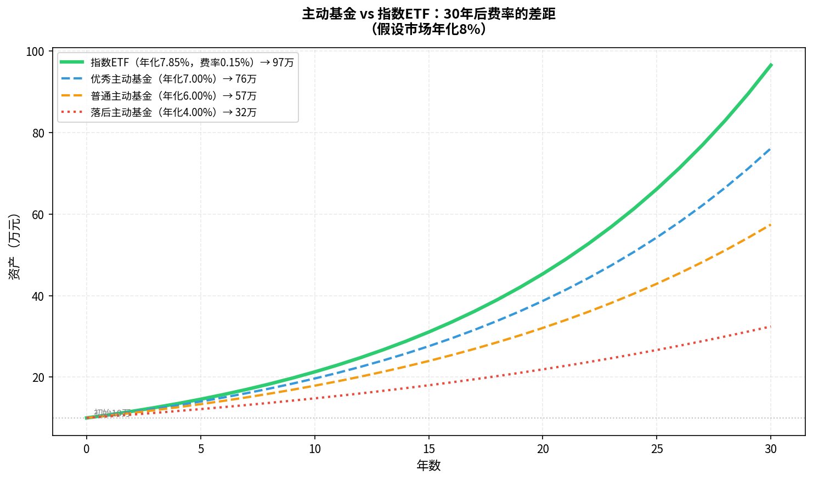
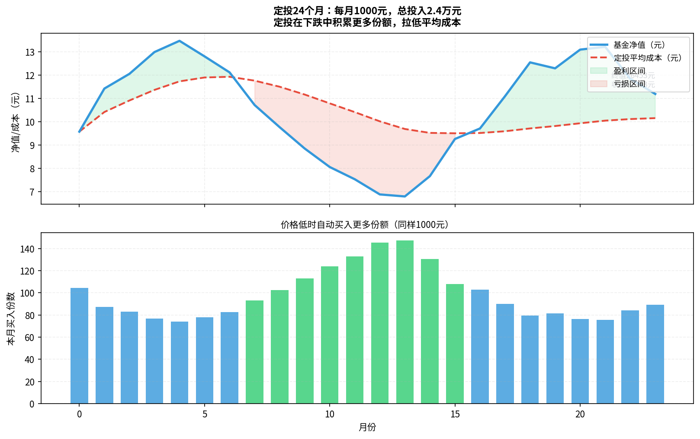

# 第五章：基金

> 不想选股？买基金——但基金也有坑，关键是选对类型。

---

## 5.1 基金是什么：集体出资、专业管理

**基金**（Fund）就是把很多投资者的钱汇集起来，由专业基金经理统一投资管理，盈亏按比例分配给所有持有人。

```
你（100元）
小王（500元）  →  基金池（10亿元）  →  基金经理  →  买股票/债券/等
老李（300元）
...
```

好处：
- 小资金也能买到分散组合
- 专业管理，不需要自己研究个股
- 门槛低（1元起投）

坏处：
- 要付管理费
- 基金经理水平参差不齐
- 不透明（主动基金持仓每季度才公布）

---

## 5.2 主动基金 vs 被动基金：谁更赚钱

这是基金领域最重要的分野：

| | 主动基金 | 被动指数基金 |
|--|---------|-------------|
| **目标** | 跑赢市场 | 跟踪市场 |
| **基金经理** | 主动选股择时 | 按指数成分自动调整 |
| **管理费** | 1-1.5%/年 | 0.1-0.5%/年 |
| **表现** | 少数长期跑赢，大多数长期跑输 | 稳定贴近指数 |
| **代表** | 主动权益基金 | 沪深300ETF、标普500指数基金 |

**大量学术研究结论**（包括诺贝尔经济学奖得主研究）：

> 超过 80% 的主动基金，在10年以上的周期里跑输对应指数。

这不是基金经理不努力，而是：
1. 在充分竞争的市场里，信息优势很难持续
2. 1.5%/年的管理费是复利杀手
3. 频繁交易的摩擦成本

---

## 5.3 指数基金：跟着市场走的低成本选择

**指数**是一组股票的集合，用来衡量市场整体表现：

```
沪深300指数 = A股市值最大的300家公司的加权平均表现
标普500     = 美国最大的500家公司的加权平均表现
纳斯达克100 = 美国科技领域最大100家公司
```

**指数基金**的任务：买入指数里的所有成分股，按相同比例持有。

优点：
- **分散**：一次性投资300家公司，单只股票崩盘影响极小
- **低费**：管理费仅0.1-0.5%，长期省下大量成本
- **透明**：持仓完全公开，买什么一清二楚
- **长期跑赢大多数主动基金**（见上节）

常见A股指数：

| 指数 | 成分股 | 特点 |
|------|--------|------|
| 沪深300 | 300只大盘股 | 代表A股整体，最主流 |
| 中证500 | 500只中盘股 | 成长性略好，波动更大 |
| 创业板指 | 深交所成长型 | 科技含量高，波动大 |
| 中证红利 | 高股息股票 | 稳健，适合偏保守 |

---

## 5.4 ETF：像股票一样交易的基金

**ETF**（Exchange Traded Fund，交易所交易基金）是指数基金的一种，可以在股票交易所实时买卖。

```
普通指数基金（场外）：
  - 每天只有一个价格（收盘净值）
  - T+1 赎回到账，T+3 才能拿到钱
  - 最低申购1元

ETF（场内）：
  - 实时交易，和买股票一样
  - T+1 卖出，T+2 到账
  - 最低1手（100份，约几百到几千元）
```

常用ETF示例：

| ETF代码 | 名称 | 跟踪指数 |
|---------|------|---------|
| 510300 | 华泰柏瑞沪深300ETF | 沪深300 |
| 510500 | 南方中证500ETF | 中证500 |
| 159949 | 华夏创业板ETF | 创业板指 |
| 513100 | 国泰纳斯达克100ETF | 纳斯达克100 |

> 场外买基金用基金代码（6位数字），场内买ETF用股票代码（6位数字）。通过券商App均可操作。

---

## 5.5 货币基金：比存款灵活的现金管理

**货币基金**专门投资短期债券、国债、票据等安全资产，流动性极高。

- 典型代表：余额宝（天弘增利宝）、微信零钱通
- 收益率：约1.5-3%，随市场利率浮动
- T+0 快速赎回：每天可取1万元
- 风险极低（历史上没有亏损记录）

> **用途**：把银行活期的钱转入货币基金，收益翻几倍，且随时可取。不适合做长期投资主力，只适合"放着等机会"的资金。

---

## 5.6 债券基金：稳健收益的选项

**债券基金**主要投资各类债券，波动比股票基金小很多：

| 类型 | 特点 | 适合 |
|------|------|------|
| 纯债基金 | 只买债券，年化3-6%，极少亏损 | 稳健型投资者 |
| 一级债基 | 债券+少量新股打新 | 稳健+略高收益 |
| 二级债基 | 债券+最多20%股票 | 中等风险 |
| 可转债基金 | 可转债为主 | 攻守兼备，波动中等 |

---

## 5.7 基金费率：申购费、管理费、赎回费怎么算

费率是长期投资的隐形杀手：

| 费用 | 何时收 | 典型值 | 备注 |
|------|--------|--------|------|
| 申购费 | 买入时 | 0-1.5% | 直销平台通常1折，即0-0.15% |
| 管理费 | 每年自动扣 | 0.1-1.5% | 已体现在净值里，感知不到 |
| 托管费 | 每年自动扣 | 0.05-0.2% | 同上 |
| 赎回费 | 卖出时 | 0-1.5% | 持有时间越长越低，7天内最高 |

**费率对比（持有30年，本金10万，年化8%）：**



即使主动基金年化跑赢指数1%，扣掉1.85%的额外费率后，30年后依然落后。这就是为什么大多数人应该选择指数基金。

---

## 5.8 如何挑选一只指数基金：以沪深300为例

挑选步骤：

1. **确定跟踪的指数**：沪深300是最稳妥的入门选择
2. **比较同类基金的规模**：规模越大越不容易清盘，至少10亿以上
3. **比较跟踪误差**：越小越好（好的ETF年跟踪误差在0.1%以内）
4. **比较管理费**：同类产品选费率最低的
5. **看流动性**：ETF的日均成交量，越大越好（避免买卖时价差过大）

常见沪深300指数产品对比：

| 产品 | 类型 | 管理费+托管费 |
|------|------|-------------|
| 华泰柏瑞300ETF（510300） | ETF | 0.1% + 0.025% |
| 嘉实沪深300（160706） | 场外 | 0.5% + 0.1% |
| 华夏沪深300（000051） | 场外 | 0.5% + 0.1% |

> **结论**：如果通过券商买，直接买ETF；如果通过天天基金/支付宝，买场外指数基金，申购费打1折后成本很低。

---

## 5.9 定投策略：用纪律克服人性弱点

**定投**（Dollar Cost Averaging，DCA）= 每隔固定时间，买入固定金额的基金，不管当时价格高低。



图中展示了定投的核心优势：
- 价格低时自动买入**更多份额**（同样1000元）
- 价格高时自动买入**更少份额**
- 长期平均成本低于平均价格

**定投的正确姿势**：
1. 选好标的（主流宽基指数基金）
2. 设定固定金额（建议每月收入10-30%）
3. 设定固定日期（如每月15日）
4. **坚持执行，不因下跌恐慌停止**（下跌时正是低价买入机会）
5. 设定止盈线（如累计盈利30-50%时分批赎回）

> **定投不是万能的**：在持续下跌的市场里，定投依然会亏损。关键是选择有长期上涨潜力的指数（如沪深300、标普500），而非行业主题基金。

---

## 本章小结

| 概念 | 要点 |
|------|------|
| 基金本质 | 集资专业管理，分散风险，门槛低 |
| 主动 vs 被动 | 80%以上主动基金长期跑输指数，费率是关键 |
| 指数基金 | 长期投资首选，沪深300/标普500是入门标的 |
| ETF | 可实时交易的指数基金，费率更低 |
| 货币基金 | 现金管理工具，替代银行活期 |
| 费率 | 管理费差1%，30年差距极大 |
| 定投 | 用纪律代替择时，适合没时间盯盘的投资者 |

**下一章**：黄金——乱世买黄金，但黄金到底是什么，如何买？

---

*← [第四章](chapter4.md) | → [第六章：黄金](chapter6.md)*
