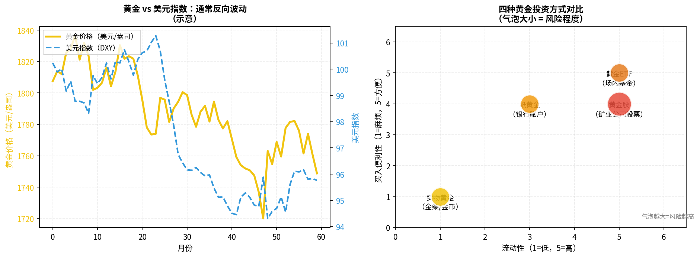

# 第六章：黄金

> 乱世买黄金——但黄金到底是什么，它为什么有价值，如何买？

---

## 6.1 黄金的本质：无息资产与价值储藏

黄金不是股票（没有利润），不是债券（没有利息），不是公司（没有经营）。它的价值来源于：

1. **稀缺性**：全球已开采黄金总量约20万吨，每年增量约3300吨（约1.6%），不能随意增发
2. **物理特性**：不腐烂、可分割、便于携带、全球公认
3. **历史信任**：几千年来人类社会普遍认可黄金作为财富储存手段
4. **去中心化**：没有任何国家或机构能"印黄金"，不受单一主权信用风险

> **核心定位**：黄金是**货币对冲工具**，当纸币购买力下降（通胀上升、货币超发），黄金往往升值。它不产生现金流，但保值能力强。

---

## 6.2 黄金价格由什么决定



影响金价的主要因素：

| 因素 | 影响方向 | 原因 |
|------|---------|------|
| 美元走强 | 金价下跌 | 黄金以美元计价，美元贵则黄金相对便宜 |
| 通胀上升 | 金价上涨 | 黄金是通胀对冲资产 |
| 实际利率上升 | 金价下跌 | 持黄金的机会成本上升（不如买债券） |
| 地缘冲突 | 金价上涨 | 避险需求增加 |
| 央行购金 | 金价上涨 | 大额需求推高价格 |

> **简洁记忆**：实际利率（= 名义利率 - 通胀）是金价最强的反向指标。实际利率越低（甚至负值），黄金越受追捧。

---

## 6.3 买黄金的四种方式

| 方式 | 流动性 | 便利性 | 风险 | 适合谁 |
|------|--------|--------|------|--------|
| 实物黄金（金条/金币） | 低 | 低（需存储）| 中 | 长期持有、传承 |
| 纸黄金（银行账户金） | 中 | 高 | 中 | 银行App操作方便 |
| 黄金ETF（场内）| 高 | 高 | 中 | 投资者首选 |
| 黄金股（矿业公司）| 高 | 高 | 高（杠杆效应）| 激进投资者 |

---

## 6.4 实物黄金怎么买

**渠道**：
- **银行**：工农中建招等大银行均有金条销售，价差约1-2%
- **上海黄金交易所（SGE）**：机构主要渠道，个人可开户，门槛较高
- **金店**（周大福、老凤祥等）：主要卖首饰，溢价高（加工费+品牌费），不适合投资
- **网上银行/App**：如工行、建行App可购买标准金条

**注意事项**：
- 存放问题：家庭保险柜或银行托管（有保管费）
- 变现时银行会鉴定，可能折价
- 买国标金条（Au9999，纯度99.99%），避免买金饰（含工艺费）

---

## 6.5 纸黄金与账户黄金

**纸黄金**是银行提供的黄金账户，不涉及实物交割：

- 在银行App开通"账户贵金属"或"纸黄金"功能
- 按国际金价买卖，银行收取买卖差价（约0.5-1元/克）
- **没有实物**，只是银行记录的黄金份额
- 流动性好，7×24小时可交易（外盘时间）

> 入门推荐：工行、建行纸黄金操作最简单，最低可买0.01克，适合小资金测试。

---

## 6.6 黄金ETF：最适合投资者的黄金工具

国内主要黄金ETF：

| 代码 | 名称 | 规模 | 管理费 |
|------|------|------|--------|
| 518880 | 华安黄金ETF | 最大 | 0.5% |
| 159934 | 易方达黄金ETF | 大 | 0.5% |
| 159937 | 嘉实黄金ETF | 中 | 0.5% |

**优点**：像股票一样买卖，实时价格，持有成本透明，流动性好。
**与纸黄金对比**：黄金ETF可以申购实物黄金兑换（大量时），纸黄金不能。

---

## 6.7 黄金在资产配置中的角色

黄金不适合作为主要投资，但非常适合作为**组合的稳定器**：

```
典型配置比例：5-15%
```

作用：
- 与股票相关性低（甚至负相关），危机时股票大跌，黄金往往上涨
- 对冲货币贬值风险
- 降低整体组合波动率

**局限性**：
- 不产生现金流（无利息、无分红）
- 长期持有的通胀调整后收益低于股票
- 仓储保管有成本
- 价格波动大，短期难以预测

> **结论**：黄金是好的"保险"，不是好的"引擎"。配置5-10%作为对冲，不要把黄金当成致富手段。

---

## 本章小结

| 方式 | 推荐度 | 理由 |
|------|--------|------|
| 黄金ETF（518880） | ⭐⭐⭐⭐⭐ | 流动性高、成本低、操作方便 |
| 纸黄金 | ⭐⭐⭐⭐ | 银行App直接操作，方便 |
| 实物金条 | ⭐⭐⭐ | 适合长期资产传承，流动性差 |
| 金饰首饰 | ⭐ | 溢价高，投资价值低 |
| 黄金股 | ⭐⭐⭐ | 有杠杆效应，但波动大 |

**下一章**：除了股票和黄金，还有什么稳健的资产？债券、银行理财、REITs……

---

*← [第五章](chapter5.md) | → [第七章：债券与其他资产](chapter7.md)*
