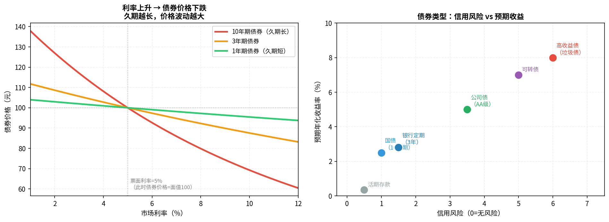

# 第七章：债券与其他资产

> 股票波动大、睡不好觉？债券是稳健投资者的基本盘。

---

## 7.1 债券是什么：借条的证券化

**债券**（Bond）是一种借贷关系的凭证：

```
你（投资者）把钱借给发行方
↓
发行方（政府/公司）给你一张"借条"（债券）
↓
约定每年支付利息（票息），到期归还本金
```

与股票对比：

| | 股票 | 债券 |
|--|------|------|
| 你的角色 | 股东（公司所有者） | 债权人（公司债主） |
| 收益 | 不确定（利润分红+价差） | 固定（票息+本金）|
| 优先级 | 破产时最后获偿 | 破产时优先于股东 |
| 风险 | 高 | 低 |

---

## 7.2 国债、企业债、可转债的区别



| 类型 | 发行方 | 风险 | 收益 | 特点 |
|------|--------|------|------|------|
| 国债 | 中央政府 | 极低（国家信用）| 低（2-4%） | 最安全，T+0变现 |
| 地方政府债 | 省市政府 | 低 | 略高于国债 | 受政府隐性担保 |
| 金融债 | 政策性银行 | 低 | 3-5% | 国开行、农发行 |
| 公司债/企业债 | 大型企业 | 中 | 4-8% | 信用评级决定收益 |
| 高收益债 | 信用差的企业 | 高 | 8%+ | 又称"垃圾债"，可能违约 |
| 可转债 | 上市公司 | 中 | 不确定 | 可以转换成股票 |

---

## 7.3 债券价格与利率的反向关系

这是债券最重要的规律，很多人不理解：

**为什么利率上升，债券价格下跌？**

```
假设你买了一张债券：面值100元，票息5%，剩余10年

现在市场利率涨到8%：
→ 新发行债券每年给8元
→ 你的旧债券每年只给5元
→ 没人愿意以100元买你的债券
→ 你必须降价到约79元，让新买家的实际收益率达到8%
→ 债券价格下跌
```

> **程序员类比**：债券价格就是未来现金流的折现值。折现率（市场利率）上升，折现值下降——就像一个函数的分母变大，结果变小。

关键规律：
- **久期越长，价格对利率越敏感**（长期债券波动更大）
- 利率下降时，长期债券涨幅更大

---

## 7.4 银行理财产品：打破刚兑后该怎么看

**2018年前**：银行理财承诺"保本保收益"——实际上银行在背后兜底，这叫**刚性兑付**（刚兑）。

**2018年后**：监管要求打破刚兑，银行理财不再保本：
- 产品净值化（像基金一样有净值，可能亏损）
- 需要区分"低风险"（主投货币市场/国债）和"中高风险"（含股票）

**如何看待现在的银行理财**：

| R等级 | 风险 | 对应资产 | 建议 |
|-------|------|---------|------|
| R1 | 极低 | 货币市场 | 可替代货币基金 |
| R2 | 低 | 债券为主 | 可配置，注意流动性 |
| R3 | 中 | 债券+少量股票 | 要看清楚底层资产 |
| R4/R5 | 高/极高 | 含股票期货等 | 非专业人士谨慎 |

> **核心建议**：银行R1/R2产品可以作为货币基金替代品，通常收益略高。R3以上要仔细看底层资产，不可盲目相信银行品牌。

---

## 7.5 REITs：用基金投资不动产

**REITs**（Real Estate Investment Trusts，不动产投资信托基金）是一种让普通投资者参与不动产投资的工具：

- 门槛低：A股公募REITs最低几百元起购
- 底层资产：高速公路、产业园区、仓储物流、数据中心等
- 收益来源：租金分红（按规定每年分配不低于90%可分配收益）
- 流动性：在交易所像股票一样买卖

> 2021年中国公募REITs正式上市，目前已有数十支产品。与直接买房相比：流动性好、门槛低、不用管理。与普通股票相比：受租金保护，相对稳定，适合保守型配置。

---

## 7.6 存款、大额存单：无风险收益基准

**大额存单**（CD）是银行发行的、金额较大的定期存款：

- 起点金额：20万元
- 期限：1个月-5年
- 利率：比普通定期高约0.1-0.5%
- 可以提前转让（部分产品）
- 受存款保险保护（50万元以内100%赔付）

| 产品 | 门槛 | 收益率（2024年大致水平） | 流动性 |
|------|------|----------------------|--------|
| 活期 | 无 | 0.35% | 极高 |
| 3年定期 | 无 | 1.5-2% | 低 |
| 大额存单（3年）| 20万 | 2-2.5% | 低（可转让） |
| 货币基金 | 1元 | 1.5-2.5% | 极高 |
| 国债（3年）| 100元 | 2.35% | 中 |

> **无风险收益率**是一切投资的基准线。如果一个投资的收益率不高于国债+风险溢价，就不值得冒额外的风险。

---

## 7.7 加密货币：高风险赛道的基本认知

**本节仅作认知科普，不建议入门期参与。**

加密货币（比特币、以太坊等）的基本属性：

**支持者观点**：
- 去中心化，不受单一主权控制
- 总量有限（比特币2100万枚），抗通胀
- 技术创新，区块链有实际应用价值

**反对/风险观点**：
- 极高波动性（年波动率可达100%+，单日涨跌20%正常）
- 监管不确定性极高（各国政策差异巨大）
- 没有内在现金流，定价纯粹靠市场情绪
- 交易所和项目方跑路风险（FTX事件等）

> **个人建议**：在对股票和基金有一定认知之前，不要接触加密货币。如果一定要参与，仓位控制在5%以内，且只买比特币/以太坊等主流资产，绝不碰山寨币。

---

## 本章小结

| 资产 | 风险 | 适用场景 |
|------|------|---------|
| 国债 | 极低 | 稳健保值，配置5-20% |
| 投资级公司债/债基 | 低中 | 稳健增值，替代部分存款 |
| 银行理财 R1/R2 | 低 | 货币基金替代品 |
| REITs | 中 | 不动产替代，稳定现金流 |
| 大额存单 | 极低 | 20万以上闲置资金 |
| 加密货币 | 极高 | 入门阶段不建议 |

**下一章**：学会看"大势"——宏观经济与市场节奏，不懂宏观就像开车不看路。

---

*← [第六章](chapter6.md) | → [第八章：宏观经济与市场节奏](chapter8.md)*
