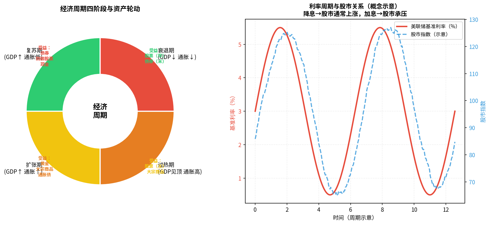

# 第八章：宏观经济与市场节奏

> 不需要成为经济学家，但要懂"大势"——避免在错误的时间做错误的事。

---

## 8.1 经济周期：繁荣、衰退、萧条、复苏

经济不是直线增长，而是周期性波动。理解周期是投资最重要的宏观工具。



### 四个阶段

**复苏期**：经济触底回升，利率低，企业开始扩张
- 特征：GDP增速回升，失业率高但开始下降，通胀仍低
- 受益资产：股票（早期入场最佳时机）、周期性行业

**扩张期**：经济持续增长，企业盈利上升
- 特征：GDP强劲，就业充分，通胀开始上升
- 受益资产：股票（仍是主力）、大宗商品

**过热期**：增长见顶，通胀高企，央行开始加息
- 特征：高通胀，央行被迫收紧，债务压力上升
- 受益资产：黄金、大宗商品、通胀保护债券（TIPS）

**衰退期**：经济下滑，企业收缩，失业上升
- 特征：GDP下降、企业利润收缩，央行开始降息
- 受益资产：国债（避险）、防御型股票（消费品、医药）、现金

> **重要提示**：经济周期转折点无人能精确预判。上面的资产轮动是统计规律，不是交易手册。用它判断大方向，而非精确择时。

---

## 8.2 美联储与央行：利率政策如何影响市场

**美联储**（Fed）是美国央行，负责制定美元利率政策。因为美元是全球储备货币，美联储的决策影响全球市场。

**中国人民银行**（央行）负责中国的货币政策。

### 核心传导机制

```
央行加息
→ 借贷成本上升
→ 企业贷款减少，扩张放缓
→ 消费贷款减少，消费降温
→ 通胀降低
→ 股票估值承压（折现率上升，PE下降）
→ 债券价格下跌（新债利率更高，旧债不值钱）

央行降息
→ 借贷成本下降
→ 企业易于扩张 → 股票上涨
→ 债券价格上涨
→ 货币贬值（资金外流） → 黄金受益
```

### 美联储重要会议
- **FOMC会议**（联邦公开市场委员会）：每年8次，每次宣布利率决定
- 通常发布"点阵图"，显示委员对未来利率路径的预期
- 美联储发言（尤其是主席鲍威尔）会直接影响当天市场

---

## 8.3 通胀数据（CPI/PPI）怎么读

**CPI**（Consumer Price Index，居民消费价格指数）
- 衡量普通居民购物篮价格变化
- 中国目标：约3%以内
- 高于目标 → 央行倾向加息；低于目标 → 倾向宽松

**PPI**（Producer Price Index，工业生产者价格指数）
- 衡量工厂出厂价格变化
- PPI上升 → 通胀向CPI传导的先行指标

> 实用技巧：CPI和PPI的走势差（CPI-PPI）衡量企业的成本转嫁能力。两者差值收窄，说明企业利润空间扩大。

---

## 8.4 GDP、PMI、就业数据：宏观指标速查

| 指标 | 含义 | 频率 | 哪里看 |
|------|------|------|--------|
| GDP | 国内生产总值，衡量经济总量 | 季度 | 国家统计局 |
| PMI | 采购经理人指数，50以上=扩张 | 月度 | 财新/统计局 |
| CPI | 消费通胀 | 月度 | 国家统计局 |
| 社融 | 社会融资规模，衡量信用扩张 | 月度 | 央行 |
| 非农就业 | 美国就业人口变化 | 月度 | 美国劳工部 |

### PMI的直觉解读

```
PMI > 50：制造业扩张（企业采购经理在增加订货）→ 经济向好
PMI < 50：制造业收缩 → 经济走弱
PMI 趋势比绝对值更重要（持续上升 vs 持续下降）
```

---

## 8.5 汇率变动对投资的影响

**汇率**是两种货币的兑换比例：1美元 = 7.x元人民币（人民币对美元汇率）。

| 汇率变化 | 对谁有利 | 对谁不利 |
|---------|---------|---------|
| 人民币升值（汇率下降）| 出国旅游者、进口商、买美股的人 | 出口企业、持有美元资产者 |
| 人民币贬值（汇率上升）| 出口企业、外资进入A股 | 进口商、有美元债务的企业 |

**对普通投资者的影响**：
- 如果你持有美股或美元资产，人民币贬值时换算回来会赚汇率差
- 如果你在国内投资，汇率影响相对间接（通过影响企业出口利润）

> 初学阶段不必过度关注汇率，但一旦投资美股或考虑资产出海，汇率是必须考虑的因素。

---

## 8.6 地缘政治与黑天鹅事件

**黑天鹅**（Black Swan）是指：极低概率、极大影响、事后才能解释的事件。

历史上的黑天鹅对市场的冲击：

| 事件 | 市场反应 | 恢复时间 |
|------|---------|---------|
| 2001年9·11 | 美股跌约15% | 约1个月 |
| 2008年金融危机 | 美股跌约55% | 约5年 |
| 2020年新冠 | 美股跌约35% | 约6个月 |
| 2022年俄乌冲突 | 能源大涨，科技股承压 | 持续影响 |

**关键认知**：
1. 黑天鹅无法预测，但可以通过分散来应对
2. 历史上每次暴跌之后，长期持有者都获得了更好的入场价格
3. 试图在黑天鹅发生时逃跑，往往卖在最低点，踏空反弹

---

## 8.7 市场情绪指标：恐慌指数（VIX）与市场温度计

**VIX**（波动率指数，CBOE Volatility Index）衡量市场的"恐慌程度"：

```
VIX < 15：市场平静，投资者乐观
VIX 15-25：正常波动区间
VIX 25-40：市场恐慌，波动加大
VIX > 40：极度恐慌（历史上2008年达到80+，2020年3月达到85）
```

**逆向指标用法**：
> "当别人恐惧时，我贪婪；当别人贪婪时，我恐惧。"—— 巴菲特

VIX极高时，往往是历史上较好的买入时机（但心理上极难执行）。

**A股情绪指标**：
- 两融余额（融资融券规模）：高位说明杠杆多，风险大
- 新开户数量：高峰时往往是市场顶部（散户入场的最后阶段）
- 北向资金净流入：外资动向，一定参考价值

---

## 本章小结

| 概念 | 关键点 |
|------|--------|
| 经济周期 | 四阶段轮动，资产配置随之调整方向 |
| 利率政策 | 降息利好股债，加息反之 |
| CPI/PPI | 通胀指标，决定央行政策方向 |
| PMI | 50是荣枯线，趋势比绝对值重要 |
| 黑天鹅 | 无法预测，靠分散应对 |
| VIX | 恐慌指数，极值处可能是好机会 |

**下一章**：理论都懂了，工具去哪找？行情、数据、研报、社区——信息平台全梳理。

---

*← [第七章](chapter7.md) | → [第九章：信息获取与工具](chapter9.md)*
